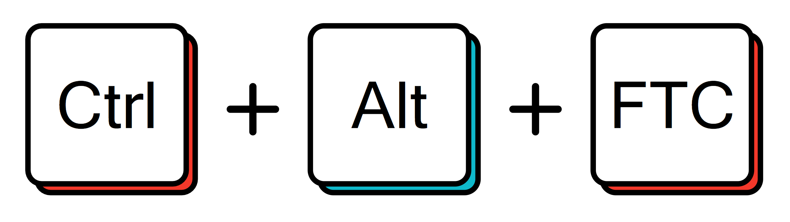

# CTRL ALT FTC

## What and Who is this Guide For?

This article is an introductory guide to the beautiful world of Control Theory for those with a background in FTC programming. This guide is for those who have just learned the basics of programming but are stuck in the grey "middle area" where resources are far below your abilities or just a little above your head. Hopefully, by the end of this guide, you will have a more intuitive understanding of control topics and feel more comfortable with the implementation of advanced controls in the context of First Tech Challenge and other fields as your STEM journey continues.

‌ This guide assumes that you have experience with the SDK. While this does make it slightly tricky for absolute beginners to follow, it also allows the knowledge to be applicable outside of First Tech Challenge.

