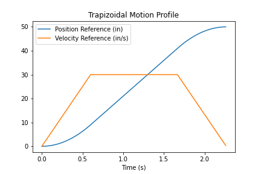

# Motion Profiling

## Motion Profiling

### Why do we need motion profiling?

Imagine that we're trying to move our robot along a 1D line to a certain reference position. If we wanted this movement to be precise, we could use a PID controller with our reference and current position, but there's an issue. Unless the distance to our reference point is very small, our error at the start will be very large, which is going to cause a correspondingly large motor input. For most FTC robots, applying maximum power from a standstill position will cause _slip_, which is undesirable because it results in non-smooth movement, traction loss, and messes up wheel odometry.

### Limiting Acceleration

The trivial method to limit acceleration is to cap the output of the PID Controller, but we can do better.

What if we could directly choose a maximum acceleration? And a maximum deacceleration too? (slip also occurs when we deacceleration too quickly!). What if we also wanted to specify a maximum velocity because we may know that some velocities are too high for us to control reasonably?

That's where motion profiling comes in!

### What are motion profiles?

Motion profiles define a trajectory for our reference over a certain time period. For every time in this period, the motion profile tells what reference we should be at. The trajectory ends at our target reference. Essentially, motion profiles smoothly move our PID's reference point to limit acceleration and velocity. Motion profiling lets us move our robot and its mechanisms far more smoothly and consistently.

To use it, we set our PID's reference to whatever the motion profile tells us to, given the current time.

### Trapezoidal motion profiles

The most common type of motion profile in FTC is the trapezoidal motion profile. It's named that way because it results in a target velocity reference graph that looks like a trapezoid, since it's limiting acceleration and velocity.

<figure><figcaption></figcaption></figure>

It consists of three phrases: acceleration, cruise, and deacceleration. In the first phase, the target velocity increases by the maximum acceleration, in the cruise phase the target velocity doesn't change, and the target velocity decreases by the maximum acceleration, ending at a target velocity of 0.

Trapezoidal motion profiles are relatively simple, and they're going to be sufficient for smooth and precise motion for pretty much any type of mechanism in FTC.

#### How do we implement trapezoidal motion profiling?

There's a few different ways to implement trapezoidal motion profiling in code, but something that all of the ways will have in common is the use of kinematic formulas. The kinematic formulas are `velocity = starting velocity + acceleration * time` and `position = starting position + starting velocity * time + (1/2) * acceleration * time`.

Here's an example of a pseudocode motion profile implementation.

```java
double motion_profile(max_acceleration, max_velocity, distance, current_dt) {
  """
  Return the current reference position based on the given motion profile times, maximum acceleration, velocity, and current time.
  """

  // calculate the time it takes to accelerate to max velocity
  acceleration_dt = max_velocity / max_acceleration

  // If we can't accelerate to max velocity in the given distance, we'll accelerate as much as possible
  halfway_distance = distance / 2
  acceleration_distance = 0.5 * max_acceleration * acceleration_dt ** 2

  if (acceleration_distance > halfway_distance)
    acceleration_dt = Math.sqrt(halfway_distance / (0.5 * max_acceleration))

  acceleration_distance = 0.5 * max_acceleration * acceleration_dt ** 2

  // recalculate max velocity based on the time we have to accelerate and decelerate
  max_velocity = max_acceleration * acceleration_dt

  // we decelerate at the same rate as we accelerate
  deacceleration_dt = acceleration_dt

  // calculate the time that we're at max velocity
  cruise_distance = distance - 2 * acceleration_distance
  cruise_dt = cruise_distance / max_velocity
  deacceleration_time = acceleration_dt + cruise_dt

  // check if we're still in the motion profile
  entire_dt = acceleration_dt + cruise_dt + deacceleration_dt
  if (current_dt > entire_dt)
    return distance

  // if we're accelerating
  if (current_dt < acceleration_dt)
    // use the kinematic equation for acceleration
    return 0.5 * max_acceleration * current_dt ** 2

  // if we're cruising
  else if (current_dt < deacceleration_time) {
    acceleration_distance = 0.5 * max_acceleration * acceleration_dt ** 2
    cruise_current_dt = current_dt - acceleration_dt

    // use the kinematic equation for constant velocity
    return acceleration_distance + max_velocity * cruise_current_dt
  }

  // if we're decelerating
  else {
    acceleration_distance = 0.5 * max_acceleration * acceleration_dt ** 2
    cruise_distance = max_velocity * cruise_dt
    deacceleration_time = current_dt - deacceleration_time

    // use the kinematic equations to calculate the instantaneous desired position
    return acceleration_distance + cruise_distance + max_velocity * deacceleration_time - 0.5 * max_acceleration * deacceleration_time ** 2
  }
}
```

### Motion Profile Usage

To use a motion profile, you must use some controller, such as a PID or Proportional Controller.&#x20;

```java
while (TrajectoryIsNotDone) {

    double instantTargetPosition = motion_profile_position(max_acceleration, 
                                                  max_velocity, 
                                                  distance, 
                                                   current_dt);

    double motorPower = (instantTargetPosition - motor.getPosition()) * Kp
}
```

You can also extend this further by using velocity/acceleration feedforward.&#x20;

```java
while (TrajectoryIsNotDone) {

    double x = motion_profile_position(max_acceleration, 
                                                  max_velocity, 
                                                  distance, 
                                                   current_dt);
    double v = motion_profile_velo(max_acceleration, 
                                                  max_velocity, 
                                                  distance, 
                                                   current_dt);
                                                   
    double a = motion_profile_accel(max_acceleration, 
                                                  max_velocity, 
                                                  distance, 
                                                   current_dt);
                                                   
    double motorPower = (x - motor.getPosition()) * Kp + Kv * v + Ka * a; 
}
```

You now know how to implement one of the most powerful control strategies in FTC!
