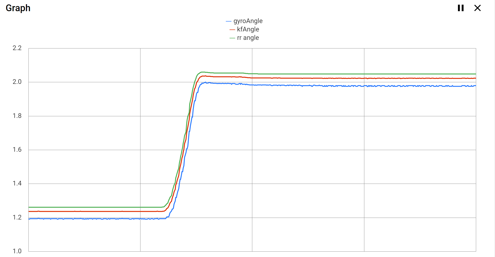
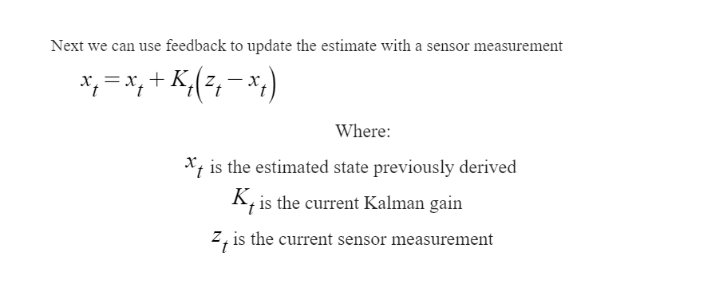
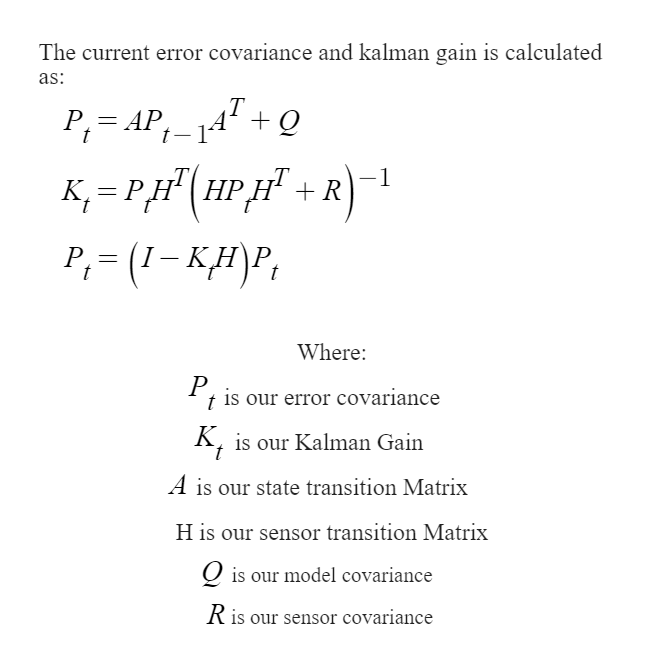
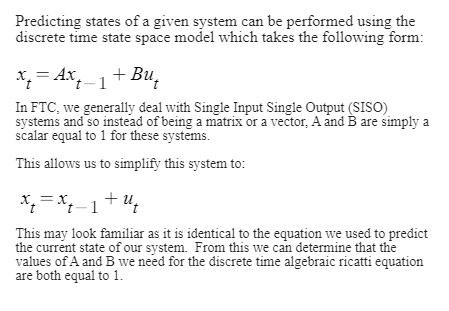
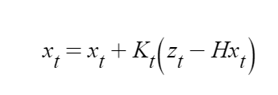
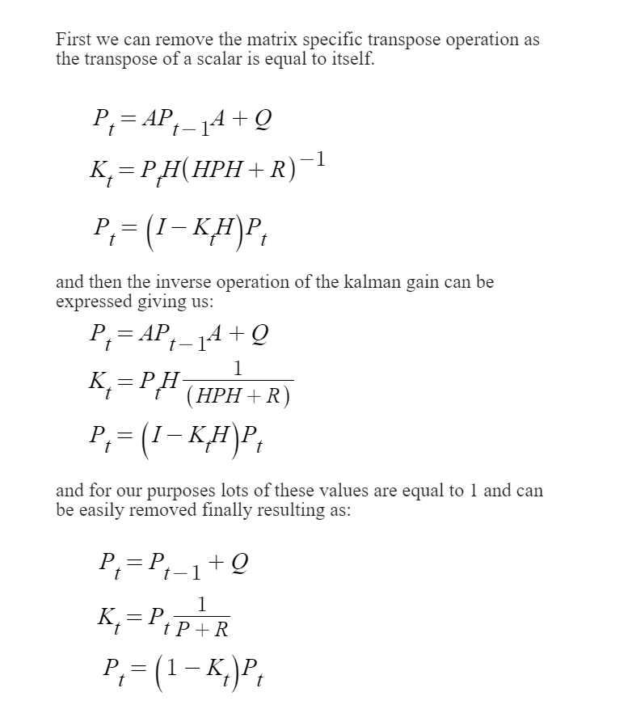
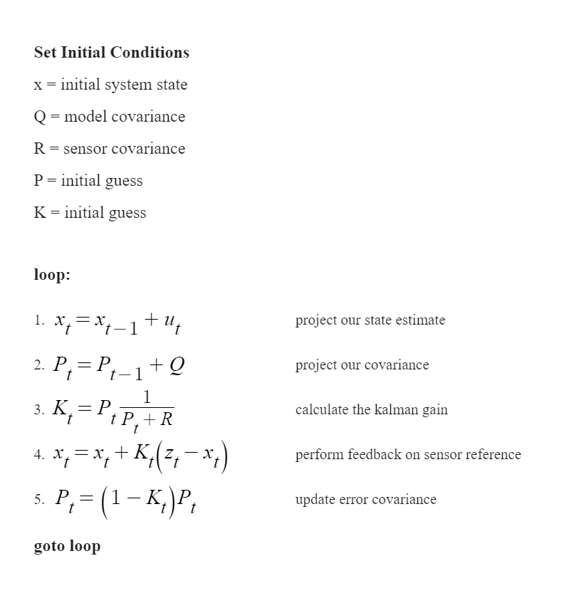

# The Kalman Filter

## What is a Kalman Filter?

A Kalman filter at the highest level is an algorithm that optimally estimates any given state of a system, given a model of how the system changes over time and knowing a set of sensor measurements. We use a Kalman filter whenever we have doubts about the quality of our sensors, and we require more reliable measurements to control our system with the performance that we desire.



## How does the Kalman Filter work?&#x20;

One common theme in control theory is feedback; feedback can also be used in the processing of sensor measurements and with feedback is where the Kalman filter gets it's magic.&#x20;

First, the Kalman filter makes an initial estimate using the following equation:

.png>)

Generally, for FTC scale applications, 'U' is simply an estimate of how much the estimate has changed since t-1. Such as the change in angle between the t and t-1.

This is a very basic estimation of the sensor state which can then be improved with feedback:&#x20;



This process of projecting the state forward using the first equation and then augmenting that estimation using a sensor estimate and feedback will repeat continuously. If the system is observable and the Kalman gain is stable, the filter will theoretically converge on the system's actual state.

_**"For a Kalman filter you are not so much interested in the "stability" of**_**  x̂ **_**(full state estimation), but in the error between x (the actual state) and**_** x̂**_**. Because if this error goes to zero, then**_** x̂ **_**will become equal to x, which is what we want."**_&#x20;

_In this quote,_ **x̂ **_**** refers to the state estimate and **x** refers to the true state._&#x20;

source: Kwin van der Veen ([https://math.stackexchange.com/users/76466/kwin-van-der-veen](https://math.stackexchange.com/users/76466/kwin-van-der-veen)), Show stability of Kalman filter, URL (version: 2017-04-13): [https://math.stackexchange.com/q/2057891](https://math.stackexchange.com/q/2057891)

### wow.

_Take a moment now to realize just how impressive the results of these two equations can be. Using nothing but a few estimates of our system, it is possible for us to eventually observe the **actual** state of our system using the magic of feedback._&#x20;

## Calculation of the Kalman Gain&#x20;

Previously we stated that 'if the system is observable and the Kalman gain is stable, the filter will theoretically converge on the system's true state.' The issue now comes down to determining the Kalman gain. Fortunately for us, the Kalman filter also has a solution known as the discrete-time algebraic Riccati equation. This equation will allow us to calculate our system covariance (P), which we can then use to derive the Kalman gain online.

‌ After some simplification, the equation for the covariance and Kalman gain measurement becomes:



These equations, when initially presented, will likely leave one with even more questions than they had before. This result is due to the significant amount of apparently unknown variables.

For A's value, we first need to understand a bit about state-space representation, which is the method of modeling used by modern control theory.



Now we have our A 'Matrix' which is simply a scalar value of 1.  In addition to this we now understand how the initial prediction of our systems state was derived. &#x20;

Next we need to find **H**.

H is what is known as the sensor transition matrix and this matrix tells us which of our systems states are directly observable by a sensor. **Since we are dealing with a SISO system and we know for a fact that it is an observable state because we have a value for Z in the feedback equation then the value for H **_**must be equal to 1**_**.** We know this because the real feedback equation actually contains this H matrix multiplied by our systems state!



In a more extensive system, the H matrix would ensure we only perform feedback on the states that we can directly measure from the sensors available. **It is simply just equal to 1 and can. Therefore, we can largely ignore it.**&#x20;

_We initialize these to a simple initial guess for the covariance (P) and the Kalman gain (K) as they will be iteratively optimized later._&#x20;

Finally, that leaves the model and sensor covariances known as Q and R. These are values that we, the implementor of the Kalman filter, have to determine. Large values of Q correspond with high trust in the model (estimate before feedback) accuracy, and large values of R correspond with high accuracy of the sensor value Z. The process of using the [DARE ](https://en.wikipedia.org/wiki/Algebraic\_Riccati\_equation)(discrete-time algebraic Riccati equation) to find P is done by to optimize for a value of K that minimizes a cost function constrained by Q, and R. Changing Q and R will change how the Kalman gain is computed and will therefore directly impact your sensor performance.&#x20;

One may have now realized that each of these 'matrices' is just a single scalar value for our applications. The result of this finding means that we can simplify the equations for calculating Kalman Gain and covariance to:



## Putting it all together

Finally we have independently derived each of the equations we need for our SISO Kalman filter.  Now we can put them together and then we will be able to effectively implement our filter in software.  Taking each simplified part and putting them into a computable procedure will yield:&#x20;



We can now relatively trivially implement the Kalman filter in java as:

```java
double x = 0; // your initial state
double Q = 0.1; // your model covariance
double R = 0.4; // your sensor covariance
double p = 1; // your initial covariance guess
double K = 1; // your initial kalman gain guess

double x_previous = x;
double p_previous = p;
double u = 0;
double z = 0; 

while (true) {

    u = getInput(); // however you want to do this (IE, taking delta of encoder)
    x = x_previous + u;
    
    p = p_previous + Q;
    
    K = p/(p + R);
    
    z = getSecondSensor(); // you are probably already using a sensor for u, 
                           // use another sensor for z
    x = x + K * (z - x);
    
    p = (1 - K) * p;
    
    x_previous = x;
    p_previous = p;

}
```

Finally, you have now implemented one of the most important filters in modern control theory. &#x20;


If one desires, they can move the steps to calculate the kalman gain / covariance operations into a 100+ iteration for loop.  This allows the user to precompute the kalman gain.  This will lead to your state estimate converging faster. &#x20;


### Implementation Example

Here you can find a jupyter notebook for a kalman filter that fuses a motion profile and velocity sensor: [https://github.com/BenCaunt/Kalman-Filter-Experiments/blob/main/velocity%20kalman%20filter%20example%20.ipynb](https://github.com/BenCaunt/Kalman-Filter-Experiments/blob/main/velocity%20kalman%20filter%20example%20.ipynb)

## Limitations of our work

For simplicity sake we made the assumption that the majority of systems we will be dealing with in FTC are single input, single output systems.  Unfortunately this is not guaranteed and you may have to end up with a more complicated filter where you must use matrices instead of scalar values.  For that you will need to use a library such as [EJML ](http://ejml.org/wiki/index.php?title=Main\_Page)and remove lots of the simplifications that we made.&#x20;
