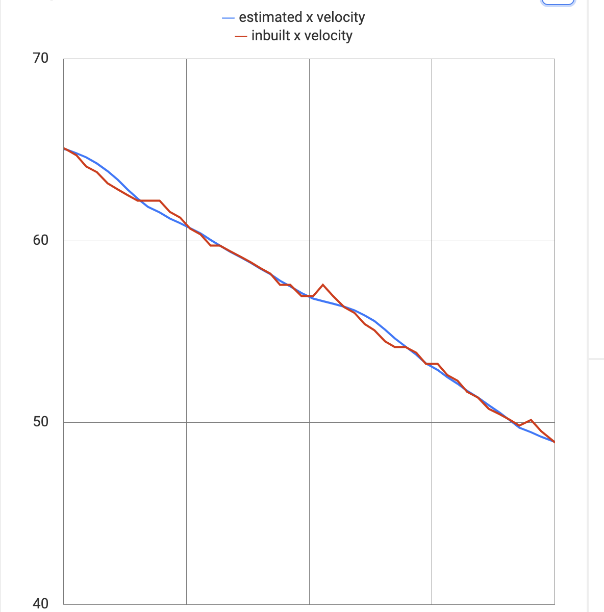

# State Estimation and Filters


While technically incorrect nomenclature, each of the individual algorithms themselves will be implemented as a Filter, then they will also have to be implemented as an estimator to be used with Systems.


## Filters

### Low pass filter

The low pass filter is a basic algorithm that allows one to smooth values given to it, this is used previously in CTRL ALT FTC to help compensate for derivative noise and is used by PIDEx for this purpose.

```java
double a = 0.9; // low pass gain, must be within 0 < x < 1
LowPassFilter filter = new LowPassFilter(a);
while (true) {
    double currentValue = readNoisySensor();  // imaginary, noisy sensor
    double estimate = filter.estimate(currentValue); // smoothed sensor
}
```

### Least Squares + Kalman Filter

Using the Kalman Filter discussed previously on CTRL ALT FTC and Linear Least Squares regression as the model,  we have developed a very robust way to remove noise from signals.

```java
double Q = 0.3; // High values put more emphasis on the sensor.
double R = 3; // High Values put more emphasis on regression.
int N = 3; // The number of estimates in the past we perform regression on.
KalmanFilter filter = new KalmanFilter(Q,R,N);
while (true) {
    double currentValue = readNoisySensor();  // imaginary, noisy sensor
    double estimate = filter.estimate(currentValue); // smoothed sensor
}
```

This Kalman Filter implementation has three parameters to tune. First **Q** is the sensor covariance, or how much we trust the sensor, low values for the sensor means that we believe the sensor will have lots of noise and vice versa. **R** is the model covariance or how much we trust the linear regression. **N** is the number of elements back we perform the regression on. we find that for most cases between 3 and 5 works best.



### Kalman Filter vs Low Pass Filter

If both the Kalman FIlter and the Low Pass filter reduce noise, and the Low Pass filter is so much simpler than the Kalman Filter, why should the Kalman Filter exist?

The answer: Phase Lag

The low pass filter removes high frequency signals from your measurements. While this does remove lots of noise from the signal (as noise is generally high frequency), it also slows down the signals response. The Kalman Filter does not have nearly as much phase lag since it works by projecting it's state forward instead of focusing soley on previous measurements.



For each of these filters, there also exists an "Estimator", each estimator is basically just a wrapper around each of these filters that uses a double supplier for more convenient use in 'systems'.


### Estimators

```java
double Q = 0.3;
double R = 3;
int N = 3;
DoubleSupplier sensor = new DoubleSupplier() {
	@Override
	public double getAsDouble() {
		return readNoisySensor();
	}
};
Estimator estimator = new KalmanEstimator(sensor,Q,R,N);
while (true) {
	double estimate = estimator.update(); // look! no arguments!
}
```

Estimators with their usage of DoubleSuppliers allow the passing of sensor values into the filter to be much more seemless.
