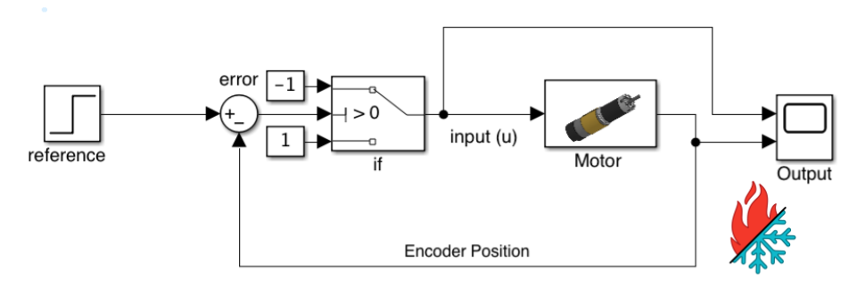
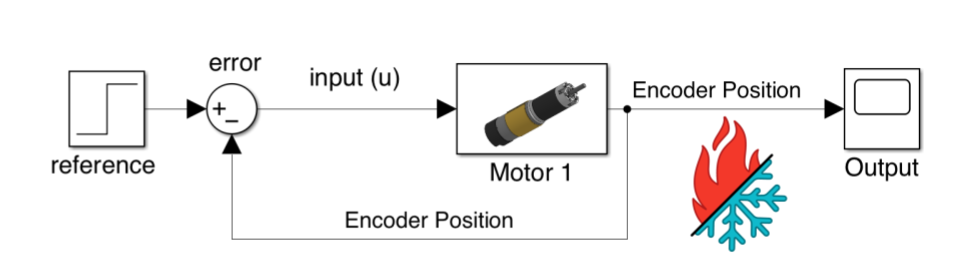

# Introduction to Closed Loop Control

## What is Closed Loop Control?

Closed-Loop Control means that we are **modifying our input to our system based on its output.**

I believe an excellent way to think about closed-loop control is driving a car driving down a highway. In this example, your steering wheel doesn't need to be commanded, and there are no other cars on the road that you need to worry about avoiding. The only thing that you must do is keep as close to the speed limit \(reference\) as possible. Let's say you look at your car's speedometer and notice you are just below the speed limit. As a result of this observation, you press on the accelerator, and your car speeds up towards the **reference**. As you get closer to the reference, you back off of the accelerator more and more until your vehicle is at the reference. This concept is the general premise of Closed-Loop Control. 


The **reference** is a term that where we want our system to be. A reference could be the target speed of a motor, the target angle that a drivetrain is facing, or any other state that we would like to control. This reference is the value that our closed-loop system is trying to converge our system's state on. 

**TLDR:** The reference is what the controller tries to converge on.


Closed-loop control requires something to estimate or observe the state of a system. The overwhelming majority of the time in FTC is an encoder, but it could easily be another sensor, such as a rev distance sensor. This observer, unfortunately, means that closed-loop control has to be mildly more complicated than open-loop control.

‌ This addition in complexity, though, is what allows closed-loop control to reject disturbances that would otherwise prevent your robot from properly achieving its purpose.

‌ Here we can see two types of closed-loop controllers.

```java
/*

* Bang Bang Controller 

*/

reference = someValue;

while (referenceIsNotReached) {

    // obtain the encoder position 
    encoderPosition = armMotor.getPosition();
    // calculate the error 
    error = reference - encoderPosition;
    
    // if too low, move up, if too high then move down 
    if (error > 0) {
        armMotor.setPower(-1);
    } else {
        armMotor.setPower(1);
    } 

}

```

```java
/*

* Proportional Controller 

*/

reference = someValue;

while (referenceIsNotReached) {

    // obtain the encoder position 
    encoderPosition = armMotor.getPosition();
    // calculate the error 
    error = reference - encoderPosition;
    // set motor power proportional to the error     
    armMotor.setPower(error);

}
```


Be warned: simply checking if the controller is at its reference is a bad idea and will often result in an infinite loop occurring. This issue is because it is unlikely to arrive exactly at the reference. However, the robot will come very close, and so a structure more like the following will work better:


```java
/*

* safer exit condition 

*/


while (Math.abs(error) > tolerance) {
    // perform controller operations
}
```

In the above examples, we have two very different types of controllers. The first one is what the average programmer would likely develop as a solution to this type of problem. This is called the Bang Bang controller. 

The Bang Bang controller is a type of Closed Loop controller that abruptly switches between two or more outputs based on the current system state. While this controller can work in many situations, it is often suboptimal and can lead to undesirable oscillations.

The second controller may look a little less familiar. This controller is the proportional feedback controller. This type of controller generates some output directly proportional to the **error** between the reference and the current state. The result of this controller is that the output is much smoother and much more predictable. The proportional feedback controller structure is almost always more desirable than that of a bang-bang controller due to the proportional controller's continuous and linear nature. We can also add onto this controller and create more complex items such as the PID controller. 





The consensus is that the proportional controller is superior to the bang-bang controller. This, however, is still not recommended, and it is often beneficial to move towards a variant of the proportional controller known as the Proportional Integral Derivative \(PID\) controller.

‌ In the next chapter, we will begin to learn about this new closed-loop controller.

#### Practice Exercises

* Try these two controllers on a drivetrain 
  * your reference should be some value in encoder ticks you want your robot to travel.
  * Does using the same controller for each of the 4 motors work or should each motors output be calculated seperately?
    * Try both!
  * Which controller performs better, the bang bang controller or the proportional controller.
    * Do the results suprise you? 
    * Do the results contradict this article? \(stay tuned for the next chapter for further advancements\).


