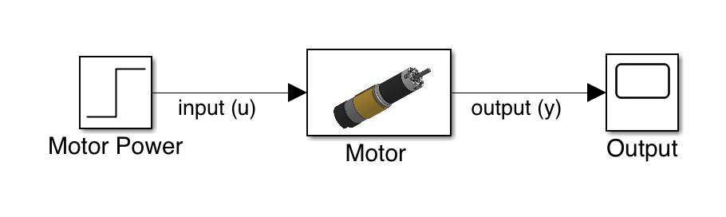

# Introduction to Open Loop Control

## What is Open Loop Control?

Open loop control simply means giving a specific output without checking it based on our input. A basic example of this is that of a time-based autonomous:

```java
// Start motors at desired speed
frontLeft.setPower(1);
frontRight.setPower(1);
backLeft.setPower(1);
backRight.setPower(1);

// Leave motors running for desired time
sleep(500)

// Stop motors after desired time
frontLeft.setPower(0);
frontRight.setPower(0);
backLeft.setPower(0);
backRight.setPower(0);
```

Another example of open loop control is that of an intake which runs continuously:

```java
// set intake power at max output
intakeMotor.setPower(1);
```


These examples and nearly all later examples assume that you have correctly set up prerequisite code such as initializing motors. If this has not been done yet, I would recommend setting this up before proceeding.




As you can see, open loop control is an incredibly simple way to get your robot performing actions. Unfortunately, this method has a few critical downfalls for certain systems:

* Cannot reject disturbances
  * Cannot overcome contact from other robots
* Energy inefficient
  * Motors must run at maximum power to utilize their maximum torque potential
* Consistency will vary as battery voltage changes.

These downfalls really only matter for certain types of systems. For example, your intake doesn't really need to reject disturbances from the outside world like your drivetrain does. This means that choosing Open Loop Control vs Closed Loop Control is decided with personal preference and the _**design requirements**_ of your system.


**Design Requirements**: What your system needs to accomplish.

Does it need to reject disturbances? Does it need to be fast? Can it be slow? How accurate does it need to be? All of these things  are factored into your system's _**design requirements**_.


#### Practice Exercises

* Try running the first example on your team's drivetrain
  * How consistent is it?
  * Does the distance vary with the battery voltage?
* Try to think of how to improve upon this method and implement those to see if it works!
