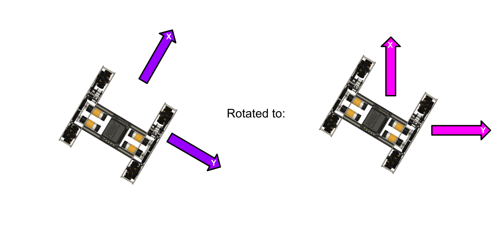

# Drivetrain Control

## Why is Drivetrain Control Hard?

In FTC we often want to drive our robot to a desired x, y, and angle position on the field.  This requires two equally important things:

* A way to measure your robots position
* A way to move your robot to a desired position 

In recent years, the idea of odometry has become increasingly popular in First Tech Challenge. Odometry simply means that we are using sensors to observe the position of your robots drive train.  The most common method of odometry in FTC is using encoders either on the drive wheels of your robot or with seperate sprung wheels known as [dead wheels.  ](https://gm0.org/en/latest/docs/robot-design/dead-wheels.html)There exists several popular libraries for doing the position estimation math but the two that we recommend are the three wheel localizer in the [Roadrunner quick start](https://github.com/acmerobotics/road-runner-quickstart) and [HolonomicOdometry](https://github.com/FTCLib/FTCLib/blob/master/core/src/main/java/com/arcrobotics/ftclib/kinematics/HolonomicOdometry.java) in FTCLib. 

Once you have a method of robot localization picked out we can begin deciding how we want to control our robot.  

Traditionally in FTC, teams used their drive encoders to drive straight some distance, switch to using the gyro to turn, and repeat for the duration of their drivetrain control. While this method is simple and effective, it is not necessarily the most robust solution. Modern FTC control systems rely on a concept known as pose stabilization. Pose stabilization uses a single controller to move each axis of your system (x,y, theta) to zero error.

## Mecanum Drivetrain Controller 

To start with controlling a mecanum drivetrain we first need for figure out how to control each robot relative axis.  A quick look at the [game manual 0 mecanum programming](https://gm0.org/en/latest/docs/software/mecanum-drive.html) guide details that given an x,y, and theta control input we can control a mecanum robot like the following: 

```java
// x, y, theta input mixing
frontLeftMotor.setPower(x + y + t);
backLeftMotor.setPower(x - y + t);
frontRightMotor.setPower(x - y - t);
backRightMotor.setPower(x + y - t);
```

The code above will allow us to very easily move our robot in the coordinate space relative to itself.  

In order to move our robot we need to [rotate](https://en.wikipedia.org/wiki/Rotation_matrix) the x and y commands by the robots angle:



To perform this rotation we can take our x command, y command, and the angle of our robot and use the rotation equation to solve for the rotated commands

```java
double x_rotated = x * Math.cos(angle) - y * Math.sin(angle);
double y_rotated = x * Math.sin(angle) + y * Math.cos(angle);
```


FTClib users can accomplish this built in by using Vector2d.rotateby(angle) method. 


we can then combine this rotation with our mecanum control mixing to get the following: 

```java
// rotation 
double x_rotated = x * Math.cos(angle) - y * Math.sin(angle);
double y_rotated = x * Math.sin(angle) + y * Math.cos(angle);

// x, y, theta input mixing
frontLeftMotor.setPower(x_rotated + y_rotated + t);
backLeftMotor.setPower(x_rotated - y_rotated + t);
frontRightMotor.setPower(x_rotated - y_rotated - t);
backRightMotor.setPower(x_rotated + y_rotated - t);
```


If one was to use gamepad joystick inputs for x,y,t they can use this code above to accomplish field relative driving!


We are at the point now that given any input, x,y,t it will push our robot in the direction regardless of the angle, we can even combine multiple inputs such as moving along diagonal paths while rotating.  We have reached a state where our system is now fully actuated and nearly completely linearized.  This means from this point on our system is now relatively trivial to control. 

For getting the values of x,y, and t we can simply use a linear controller such as the full state feedback or PID controllers that we developed in previous chapters 

```java
xControl = new PID();
yControl = new PID();
thetaControl = new PID();

while (loopIsActive) {
    // this imaginary pid controller has a control method that uses the 
    // PID controller we defined earlier in a method called calculate
    // the first argument of calculate is thereference
    // the second is the systems state. 
    x = xControl.calculate(xTarget, xRobotPosition); 
    y = yControl.calculate(yTarget, yRobotPosition);
    t = thetaControl.calculate(thetaTarget, thetaRobotPosition);
    double x_rotated = x * Math.cos(angle) - y * Math.sin(angle);
    double y_rotated = x * Math.sin(angle) + y * Math.cos(angle);
    
    // x, y, theta input mixing
    frontLeftMotor.setPower(x_rotated + y_rotated + t);
    backLeftMotor.setPower(x_rotated - y_rotated + t);
    frontRightMotor.setPower(x_rotated - y_rotated - t);
    backRightMotor.setPower(x_rotated + y_rotated - t);
}
```


For thetaControl you will need to consult the [Dealing with Angles](https://www.ctrlaltftc.com/controlling-heading) chapter for changing the way that the angle error calculation is performed.  This will ensure your robot is always turning the shortest distance to the desired angle



After completeting all of these steps you will now have a fully functional pose stabalization controller for a mecanum robot!



Disturbance rejection qualities of similar control technique


## Differential Drivetrain Controller

Differential drive robots such as 4 wheel drive, 6 wheel drive, and tank tred robots are unfortunately a beast to control.  This is because of one unfortunate quality that differential drive robots possess: They are underactuated systems.  

In control theory an underactuated system is defined as a system that has less actuators than they do outputs to control.  Intuitively it makes sense as a fully actuated system such as a mecanum drive can move towards the desired x,y position while turning towards the desired angle.  A differential drive robot cannot do this.  Instead it needs to first turn towards the target x,y position, move towards the target position and then once at the x,y position turn to the desired angle.  

### Naive Differential Drive Controller 

While not perfect, this approach to differential drive control can be very effective. This controller works by first driving to the desired position, and then once the robot is within a desired distance to the position turns toward the target angle. 

This controller requires feedback on three seperate values

* The distance to the target point 
* The angle to the target point 
* The reference angle 


Remember: The angle to the target point is the angle between the robot and the target x,y position.  The reference angle is the angle we want the robot to be facing whenever it finishes the movement. 


First we need to figure out the distance to our target position 

```java
public static double getDistance(double robotX, double robotY, double referenceX, double referenceY) {
    return Math.sqrt(Math.pow(robotY-referenceY,2) + Math.pow(robotX-referenceX,2));
}
```

Using the following will drive the robot at a power proportional to the distance between the robot position and the target position 

```java
distanceController = new PID();

while (loopIsActive) {
    // 0 is the reference because we want the distance to go to 0 
    double f = distanceController.calculate(0,getDistance(robotX,robotY,tagetX,targetY));
    double t = 0; 
    frontLeftMotor.setPower(f + t);
    backLeftMotor.setPower(f + t);
    frontRightMotor.setPower(f - t);
    backRightMotor.setPower(f - t);
}
```

 Now we have code that given the robots position and a target position will drive proportional to its remaining distance.  We still need to make the robot turn towards the target point otherwise it will continue on in whatever direction the robot started in forever.

For this, we first need to find a way to calculate the angle between the robot and the target.   Fortunately for us, there is a built in java method to accomplish this known as atan2.  Atan2 is a special trigomentric function that given arguments y,x returns the angle from x,y to the origin.  Since we are getting the angle between two points we use the error between the robot x,y and the target x,y as follows: 

```java
double xError = targetX - robotX;
double yError = targetY - robotY; 
double theta = Math.atan2(yError,xError);
```


Make sure that you use your y value as the first argument followed by the x value as the java [Math library javadoc](https://docs.oracle.com/javase/8/docs/api/java/lang/Math.html) states is required for the atan2 method to function correctly. 


now that we can calculate this angle we can put this into the control loop for our turn command: 

```java
distanceController = new PID();
angleController = new PID();  // make sure this follows "Dealing with Angles" 

while (loopIsActive) {
    double xError = targetX - robotX;
    double yError = targetY - robotY; 
    double theta = Math.atan2(yError,xError);
    // 0 is the reference because we want the distance to go to 0 
    double f = distanceController.calculate(0,getDistance(robotX,robotY,tagetX,targetY));
    double t = angleController.calculate(theta, robotTheta); 
    frontLeftMotor.setPower(f + t);
    backLeftMotor.setPower(f + t);
    frontRightMotor.setPower(f - t);
    backRightMotor.setPower(f - t);
}
```


I understand you are probably tired of hearing this but for angles and feedback control you MUST FOLLOW THE [DEALING WITH ANGLES CHAPTER](https://www.ctrlaltftc.com/controlling-heading) OR YOUR CONTROLLER _**WILL**_ BREAK. 


Now we have a controller that will drive to a desired x,y position on the field but unfortunately will not stop at the desired angle. A quick but unfortunately not very elegant solution is to simply check if we are within an acceptable distance and simply switch to turning the robot:

```java
distanceController = new PID();
angleController = new PID();  // make sure this follows "Dealing with Angles" 

while (loopIsActive) {
    double xError = targetX - robotX;
    double yError = targetY - robotY; 
    double theta = Math.atan2(yError,xError);
    // 0 is the reference because we want the distance to go to 0 
    double distance = getDistance(robotX,robotY,tagetX,targetY);
    
    if (distance > threshold) {
        double f = distanceController.calculate(0,distance);
        double t = angleController.calculate(theta, robotTheta);     
    } else {
        double f = 0
        double t = angleController.calculate(targetAngle, robotTheta); 
    }

    frontLeftMotor.setPower(f + t);
    backLeftMotor.setPower(f + t);
    frontRightMotor.setPower(f - t);
    backRightMotor.setPower(f - t);
}
```


Now you have a controller that will drive to a desired x,y, theta position


### Ramsete Controller

Coming soon! But for now check out the [wpilib](https://docs.wpilib.org/en/stable/docs/software/advanced-controls/trajectories/ramsete.html) docs for information on the FRC ramsete controller! 
