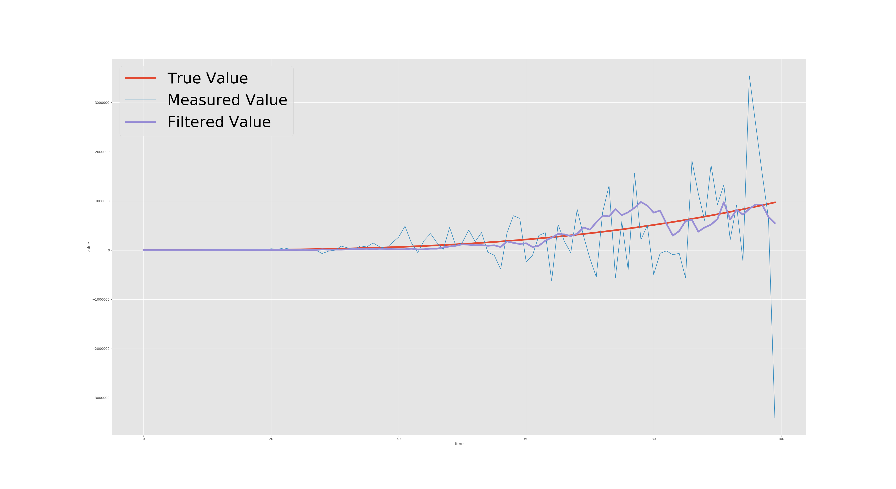

# Practical Improvements to the PID Controller

## Issues with the Traditional PID Controller

The traditional PID implementation as seen in previous chapters has a few inherent issues.  The two most common ones which we will discuss are that of integral windup and  derivative noise amplification. 

Each one of these methods has a relatively basic solution which we will analyze as this chapter progresses.

#### Basic problems and solutions 

* Integral windup
  * Integral sum cap
  * Integral sum reset
* Derivative noise amplification
  * Filter derivative input

### Integral Windup and Mitigation Methods 

Integral windup is a phenomenon that occurs whenever the integral output saturates our system.  Integral windup causes the system to remain traveling in the same direction for some time until the integral sum drops low enough for our system to regain control.  Brian Douglas does a fantastic job of explaining the issue of Integral windup on the Matlab youtube channel [here](https://youtu.be/NVLXCwc8HzM?t=201).    
  
There are a few easy things that can be implemented to help reduce the likely hood of integral windup occuring.  One of these is to simply put limits on our Integral sum such as in the following code example:

```java
// sum our integral
integralSum = integralSum + (error * timer.seconds());

// set a limit on our integral sum 
if (integralSum > integralSumLimit) {
    integralSum = integralSumLimit;
}
if (integralSum < -integralSumLimit) {
    integralSum = -integralSumLimit;
}

```

The code above effective sets hard limits on how big our integral sum can arrive at.  For FTC motor control I recommend making it so that your integralSumLimit \* Ki  is around ~0.25.  This is definitely up to preference and will need to be played around with a bit but it is enough to where it actually makes a difference in most systems but not too much that the system can become unstable. 

Another thing that is good practice to do for many systems is to reset our integral sum whenever the reference changes.  


Integral reset is a technique that needs to be evaluted on a system by system basis.  It will inherently play better with some systems than others.    
  
For example, resetting the integral will likely work a lot better on a stable system like a drivetrain than on a less stable system such as a rotating arm where the integral is needed to support it's weight.


Here is how to implement the integral reset in software:

```java
// reset the integral if the reference is changed. 
if (reference != lastReference) {
    integralSum = 0;
}
```

For many systems such as a drivetrain, doing this allows you to more easily change directions without waiting for the integral sum to change directions.  

### Derivative Noise Amplification and Mitigation Methods

If we recall from the chapter on the derivative term of a PID controller we know that increasing the gain  of our derivative term can potentially result in unstable oscillations.  This is because the nature of the derivative when it attempts to slow down the rate of change of the system can create an unstable feedback loop resulting in oscillations that increase in amplitude.  The same thing can happen when our source of data is unreliable and noisy.  While we cannot perfectly fix noisy data without a perfect model we can use a series of filters to remove much of the high frequency noise that appears in our measuremets.  One such method is known as the **low pass filter**.  
  




In the above graph we can see how the low pass filter is able to remove significant amounts of the noise  of our measurement but how does it do this?

The low pass filter takes the following form: 

$$
x_c=ax_p+(1-a)x_m
$$

Where:

**Xc** = current estimate  
**Xp** = previous estimate  
**Xm** = current measurement  
**a** = measurement gain \(0 &lt; a &lt; 1\)

This filter is tuned by adjusting the gain **a**.  Small values of **a** allow each new measurement to have more influence on the estimate than small values of **a**.  This filter works because we are calculating the **previous estimate \* the percentage + the measurement \* the complement of the percentage** **\(1 - a\)**  which results in a whole estimate being created.  This process iterates, updating the estimate at each timestep.  

#### Low Pass Filter Implementation 

The low pass filter can be implemented in software similarly to the following example:

```java
a = 0.8; // a can be anything from 0 < a < 1
previousEstimate = 0;
currentEstimate = 0;

currentEstimate = (a * previousEstimate) + (1-a) * error
previousEstimate = currentEstimate 
```

The following code if used as the input to our derivative will likely have significantly improved performance with the use of noisy sensors.  These noisy sensors may include but are certainly not limited to that of the Rev Expansion Hub IMU and the Modern Robotics Distance sensor.  These sensors produce high frequency noice that have the potential to cause issues if not properly filtered.    
  
The end result of our additions to both our Integral and Derivative terms look something like the following:

```java
/*

* Proportional Integral Derivative Controller w/ Low pass filter and anti-windup

*/

Kp = someValue;
Ki = someValue;
Kd = someValue;

reference = someValue;
lastReference = reference; 
integralSum = 0;

lastError = 0; 

maxIntegralSum = someValue; 

a = 0.8; // a can be anything from 0 < a < 1
previousFilterEstimate = 0; 
currentFilterEstimate = 0;

// Elapsed timer class from SDK, please use it, it's epic
ElapsedTime timer = new ElapsedTime();

while (setPointIsNotReached) {


    // obtain the encoder position 
    encoderPosition = armMotor.getPosition();
    // calculate the error 
    error = reference - encoderPosition;
    
    errorChange = (error - lastError)
    
    // filter out hight frequency noise to increase derivative performance
    currentFilterEstimate = (a * previousFilterEstimate) + (1-a) * errorChange; 
    previousFilterEstimate = currentFilterEstimate;
    
    // rate of change of the error 
    derivative = currentFilterEstimate / timer.seconds();
    
    // sum of all error over time
    integralSum = integralSum + (error * timer.seconds());
    
    
    // max out integral sum 
    if (integralSum > maxIntegralSum) {
        integralSum = maxIntegralSum;
    }
    
    if (integralSum < -maxIntegralSum) {
        integralSum = -maxIntegralSum;
    }
    
    // reset integral sum upon setpoint changes
    if (reference != lastReference) {
        integralSum = 0;
    }

    out = (Kp * error) + (Ki * integralSum) + (Kd * derivative);        
            
    armMotor.setPower(out);

    lastError = error; 
    
    lastReference = reference; 
    
    // reset the timer for next time 
    timer.reset();
    
}
```

Now we have fixed any of the issues that can cause issues with your control system.  We have fixed the issue of derivative amplifying noise in the system and the issue of integral windup.  Now your system will likely be more stable and there is significantly less risk of external disturbances or poor sensor quality disrupting your robot on the field.  

