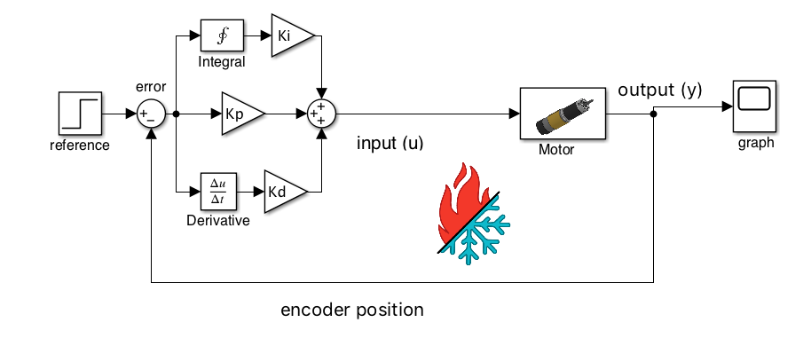

# The PID Controller

## What is a PID Controller?

A PID Controller has its roots tied to the proportional controller we looked at in the previous chapter but has numerous additions. The structure is, however, very similar. From the Simulink model below, we can see that it still consists of some output that's generated relative to the error between the reference and the system's state.

The difference comes to what we put between the system we are controlling and our error term.

Our PID Controller consists of three main parts. The Proportional \(P\), the Integral \(I\), and the Derivative \(D\).





There are a few things in this model above that may not be totally intuitive at first glance.    
  
1. The triangle symbols signfiy a "gain" or a value multiplied by it's input.   

2. The block with the three addition symbols adds up the entirety of it's three inputs as it's output. 


 

### What the heck are these "Kp, Ki, and Kd" things anyway?

‌

PID has three values that the programmer tunes. These values are Kp, Ki, and Kd. These values are multiplied by their corresponding input.  Changing these values changes how the controller behaves. Changing these values is what it means to "tune a PID Controller." The proportional term or **Kp** is a value that is directly proportional to the error of the system. To get the Proportional output, we take the **Kp \* error** and add it to our system's input. Changing Kp determines how fast or how slow the system moves towards 0 error. **You can think of Kp like a rubber band, where the thicker it is, the harder it is to pull away from its equilibrium point.** 

The derivative term or **Kd** is a value directly proportional to the rate of change of the error of the system. To calculate this, we can find the slope of the error from the last update to the current update of the loop. Derivative ensures that our system isn't responding too quickly by penalizing excessive rates of change. **You can think of Kd as increasing friction of your skates on an ice skating rink. The lower the friction, the harder to control, and you need a little bit of** _**dampening**_ **to allow you to keep yourself stable.**  ****

The Integral term or **Ki** is directly proportional to the **sum of all the errors over time**. This allows the system to **overcome** nonlinear effects such as static **friction** that would otherwise be difficult to tune out. **This works by adding up the remaining error until the output grows large enough to overcome the constant disturbance.** 

## Pseudocode Implementation of PID 

```java
/*

* Proportional Integral Derivative Controller 

*/

Kp = someValue;
Ki = someValue;
Kd = someValue;

reference = someValue;

integralSum = 0;

lastError = 0; 

// Elapsed timer class from SDK, please use it, it's epic
ElapsedTime timer = new ElapsedTime();

while (setPointIsNotReached) {


    // obtain the encoder position 
    encoderPosition = armMotor.getPosition();
    // calculate the error 
    error = reference - encoderPosition;
    
    // rate of change of the error 
    derivative = (error - lastError) / timer.seconds();
    
    // sum of all error over time
    integralSum = integralSum + (error * timer.seconds());

    out = (Kp * error) + (Ki * integralSum) + (Kd * derivative);        
            
    armMotor.setPower(out);

    lastError = error; 
    
    // reset the timer for next time 
    timer.reset();
    
}
```

\*\*\*\*

