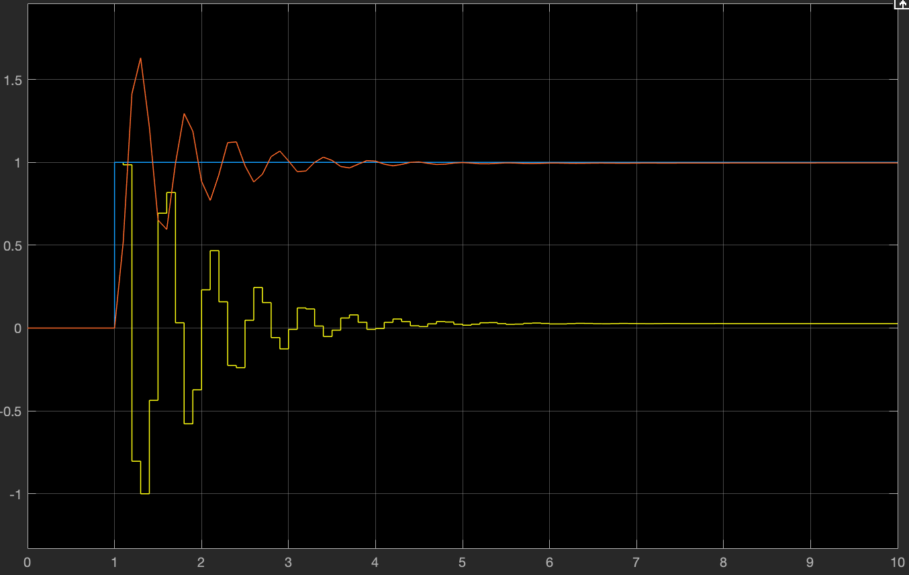
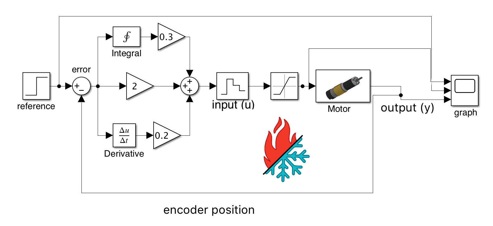
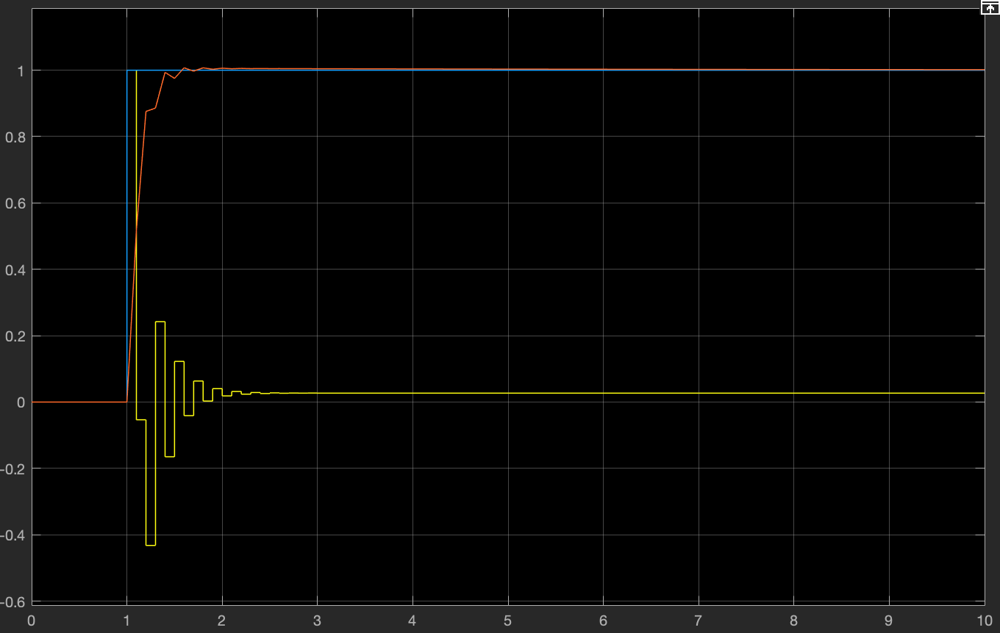
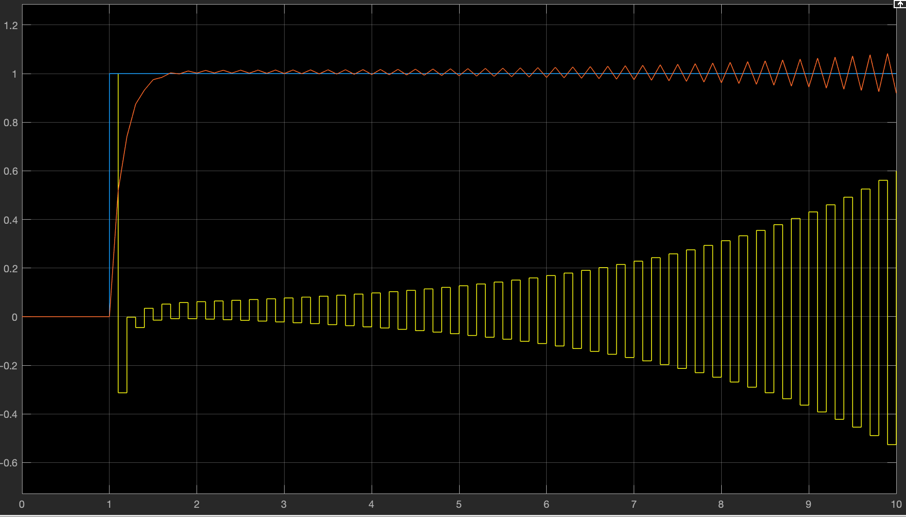

# The Derivative Term

## The Derivative Term

You can think of the PID controller's derivative term like a car's suspension or another type of dampener. The derivative of a PID controller is just the current rate of change of the error. If you think back to your first algebra class, you probably remember a formula that looked something like the following to get the slope of a line: 


 The derivative of a PID controller effectively does the same thing. We calculate the current rate of change of the error by doing the following:

\
**(error - last error) / delta time**

\
The error is the difference between the reference and the current position. The last error is the previous error, and delta time is the time between the sampling of the previous measurement and the current measurement.

```java
derivative = (error - lastError) / timer.seconds();
```

### How does Derivative effect the PID controller?

The PID controller's derivative term affects the PID controller by subtracting from the output as the rate of change increases or decreases. Assuming that the controller is functioning correctly and error decreases, the derivative of the error will be negative. The result is then multiplied by its constant (Kd) and then added to the total output. A properly tuned derivative term will remove / significantly reduce oscillations of the controller.

### Picking up where we left of

Last time we had a controller with only Proportional and Integral control. This controller worked well to reach the reference with 0 steady-state error, but it suffers from violent oscillations.



We can add derivative to this system to attempt to reduce these oscillations.  





This response is significantly better! It reaches 0 steady-state error, and it barely overshoots!

‌ With derivative, we need to be careful about how much Kd gain we add to the system. This is because the derivative slowing itself could cause a feedback loop and turn into an amplifier.



As you can see from this plot above, just a little bit of extra gain makes our system unstable, and eventually, it will grow into an uncontrollable oscillation. This effect is suboptimal, but as long as we properly tune our Kp, Ki, and Kd gains, this issue will not occur.

In the next chapter, we will look at different methods to tune a PID controller to achieve optimal results.

### Practice Exercises

Now that we fully understand each of the three terms of a PID controller, implement the controller on a drivetrain or some other mechanism and try your best at tuning it.  
