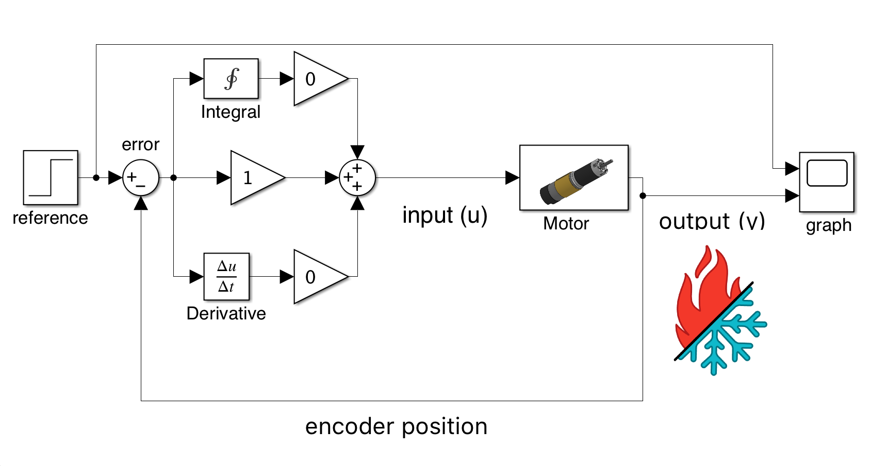
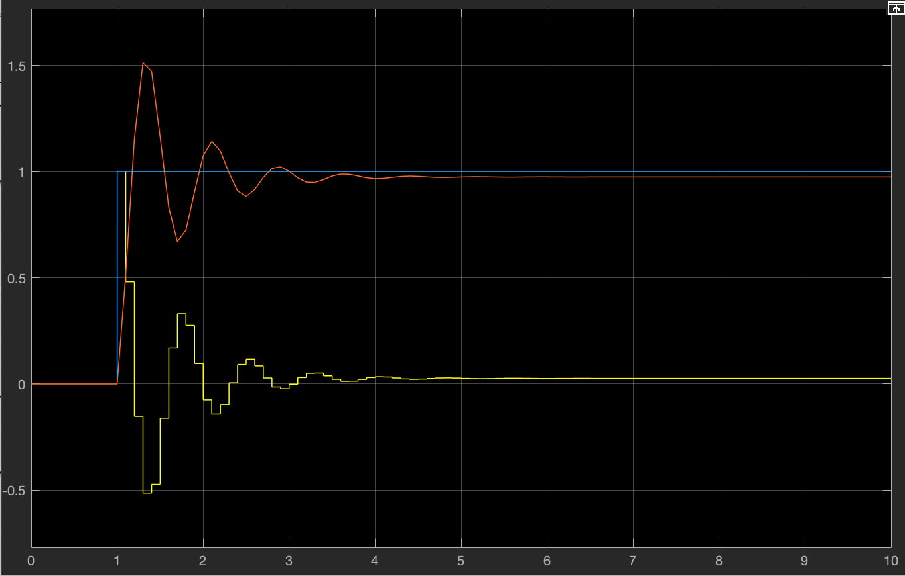

# The Proportional Term

## The Proportional Term

The proportional term is arguably the essential part of the PID Controller. The proportional term is the part that does the majority of the lifting for most systems and is what drives the error the closest to 0. Increasing Kp makes your system approach the reference faster, and decreasing it slows down the response. **Naively many may believe in increasing Kp as much as possible, but this will lead to many issues.** Increasing Kp too high will result in what is called **overshoot**. Overshoot occurs when the controller cannot slow down the system quickly enough, and the system ends up moving past the reference before moving backward and settling back down. In many systems, such as that of linear slides, this can be **very dangerous**. 

### How does changing Kp affect the dynamics of our system?

The recommended way to begin tuning with PID is to set I and D to 0 until you get the desired response from P. This inherently makes sense because the proportional controller contributes to most of the controller's output most of the time.

In the model above we have our familiar PID controller but with our integral and our derivative disabled (set to 0). This means that only our proportional control is active. With Kp set to 1 this system should act Identically to the proportional controller in the [Introduction to Closed Loop Control ](https://www.ctrlaltftc.com/introduction-to-closed-loop-control)chapter. 

Here we can see the response from this system:


The red line is the response of the system over time (such as the encoder position, angle of a potentiometer, IMU angle, etc) and the blue line is our reference signal. The yellow line is the command sent to the device we are attempting to control such as our motor.  


As we can see from this example, we have a bit of steady-state error. The presence of steady-state error means that our controller is not tracking the reference well. We can likely combat this by increasing Kp. 

As we can see the performance of our system is improved. Do notice that we are **saturating** our system slightly. The aforementioned is because our system can only actually go up to **1** power in the FTC SDK. We are using more than this is not possible for our system. This issue is even more evident at higher gains.  

.png>)

We can see here that the steady state error is slightly reduced but is still there. We will resolve this in the next chapter. 

#### Practice Exercises

* Try implementing a P controller on a simple motor
* Try controlling the encoder position of the motor
* Try controlling the speed of the motor
  * The DcMotorEx class has a getVelocity method that you can use to get the number of encoder ticks per second
* What happens if the gain Kp is too low?
* What happens if the gain Kp is too high?
* Try implementing the controller on a drivetrain
  * Does it work better if each motor has it's own controller?
  * Does it work better if all the motor uses the same controller?
